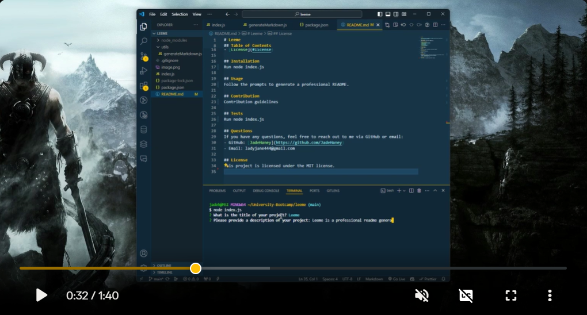

# Leeme

## Description
Leeme is a professional readme generator

## Video: Example of Application User Flow
(https://app.screencastify.com/v3/watch/2qZWRDXsEZBXTUkyefB3)

## Table of Contents
- [Installation](#installation)
- [Usage](#usage)
- [Contribution](#contribution)
- [Tests](#tests)
- [Questions](#questions)
- [License](#license)

## Installation
Instalation instructions here

## Usage
Usage Information Here

## Contribution
Contribution guidelines here

## Tests
Run node index.js

## Questions
If you have any questions, feel free to reach out to me via GitHub or email:
- GitHub: [JadeHaney](https://github.com/JadeHaney)
- Email: ladyjane444@gmail.com

## License
This project is licensed under the MIT license.
