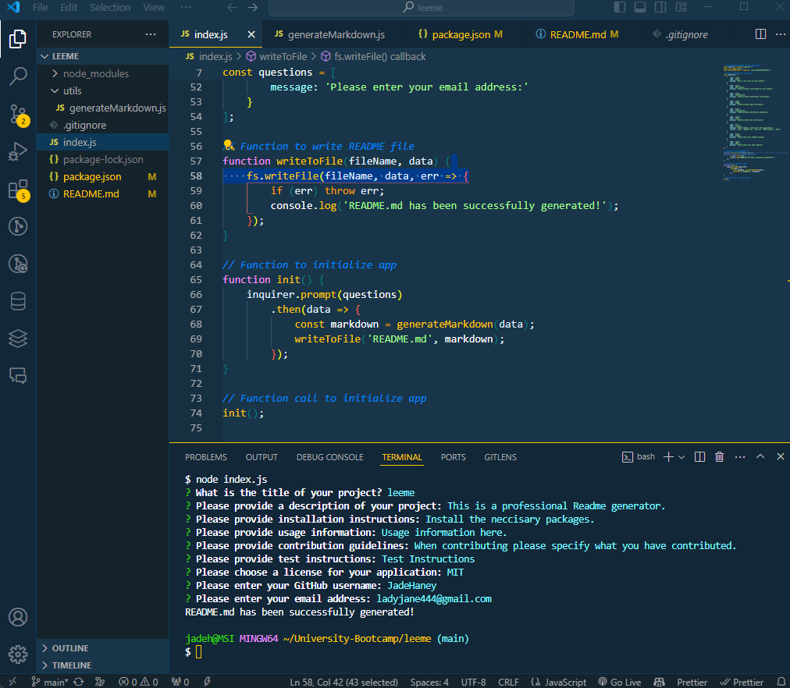

# leeme

## Description
This is a professional Readme generator.

## Table of Contents
- [Installation](#installation)
- [Usage](#usage)
- [Contribution](#contribution)
- [Tests](#tests)
- [Questions](#questions)
- [License](#license)

## Installation
Install the neccisary packages.

## Usage
Usage information here.

## Contribution
When contributing please specify what you have contributed.

## Tests
Test Instructions

## Questions
If you have any questions, feel free to reach out to me via GitHub or email:
- GitHub: [JadeHaney](https://github.com/JadeHaney)
- Email: ladyjane444@gmail.com

## License
This project is licensed under the MIT license.
tack/github/professional-readme-guide

## Example of application functionality

